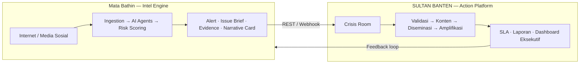
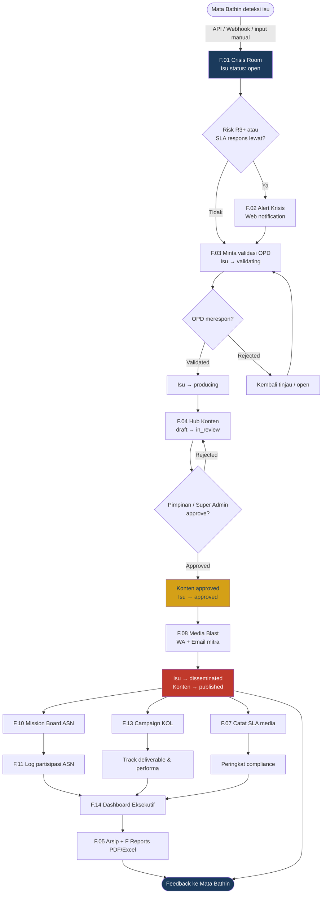
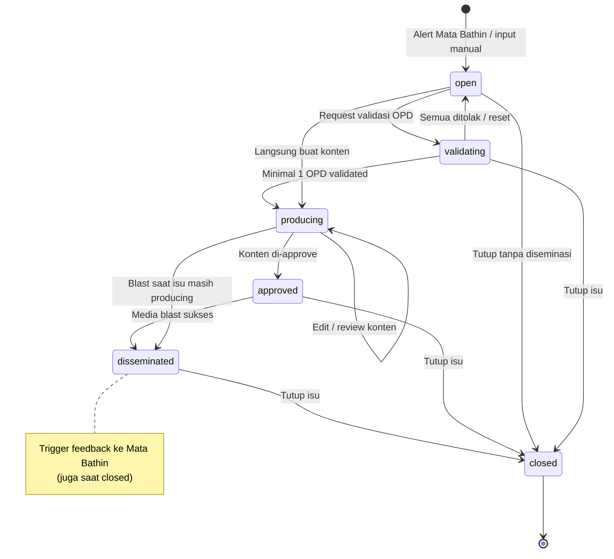
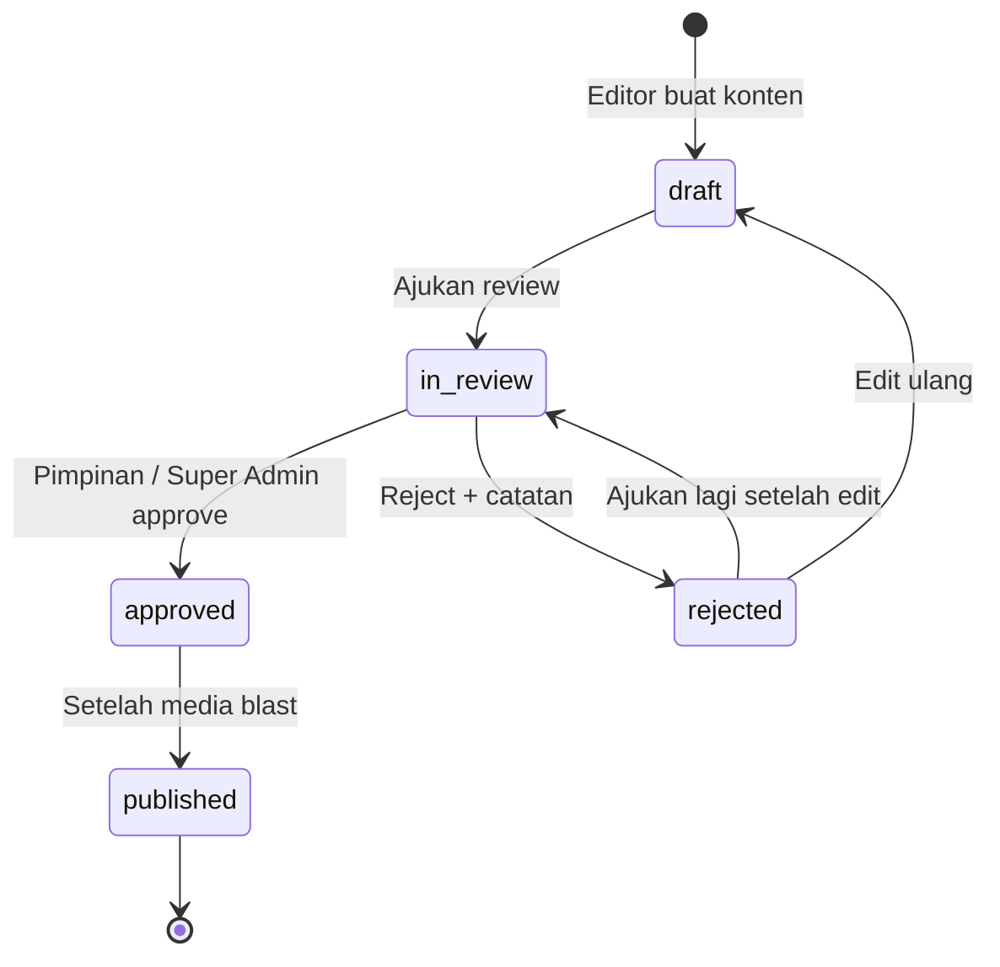
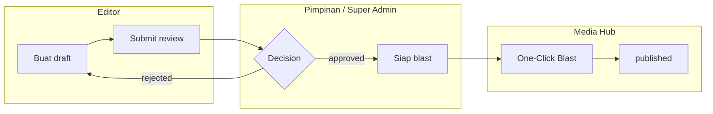
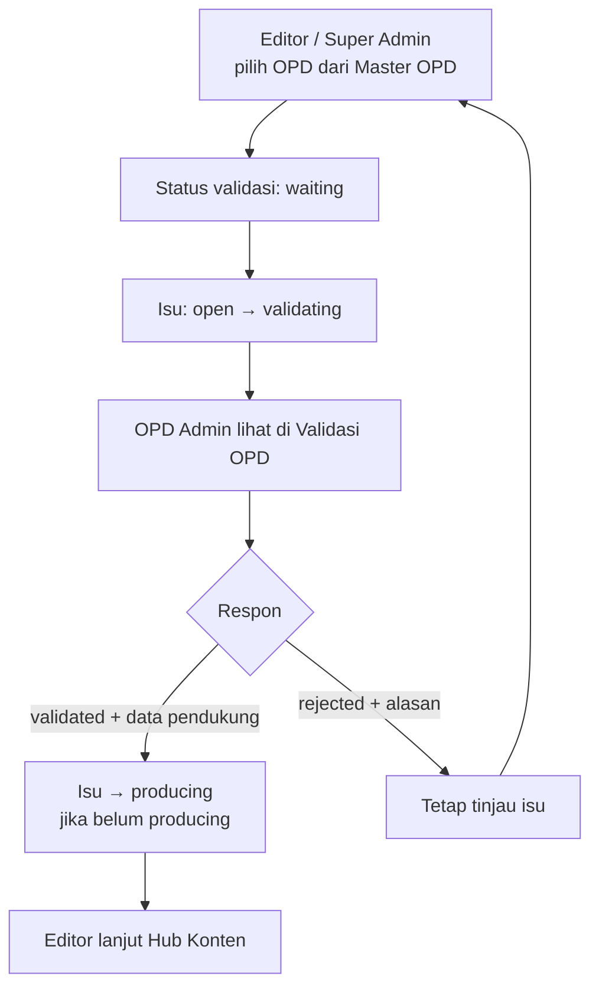
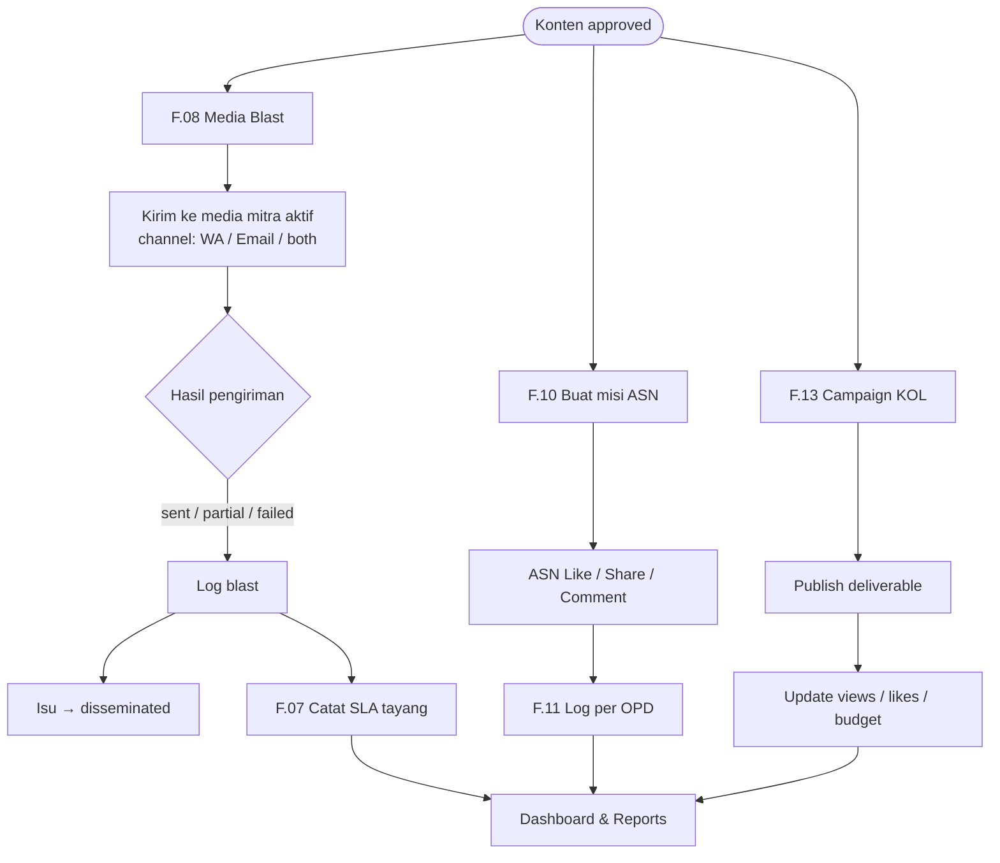
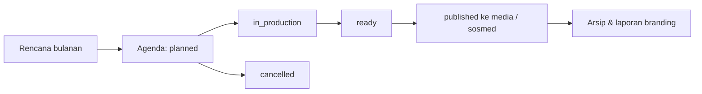
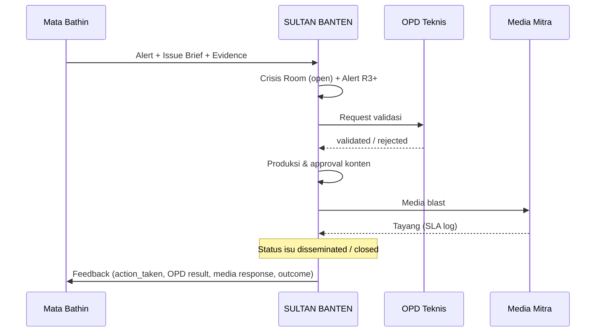
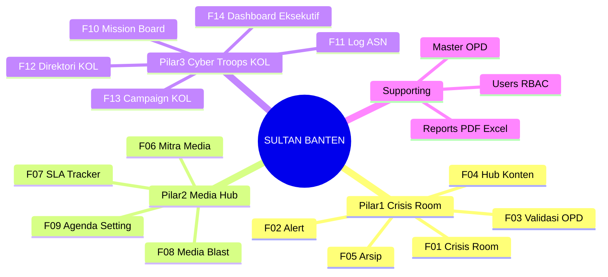

# Business Process — SULTAN BANTEN

Alur proses sesuai [SultanBanten-PRD.md](./SultanBanten-PRD.md) dan implementasi aplikasi saat ini (status isu, konten, validasi, blast, ASN, KOL).

---

## 1. Peta konteks (Mata Bathin ↔ SULTAN BANTEN)

| Sisi | Peran |
|---|---|
| **Mata Bathin** | Deteksi, skor risiko R0–R5, brief, rekomendasi |
| **SULTAN BANTEN** | Eksekusi respons: OPD, konten, media, ASN, KOL, arsip, laporan |

---

## 2. SOP end-to-end — Kontra-isu (alur utama)

Alur ini memetakan **§8 Mapping SOP** di PRD ke modul yang ada di aplikasi.

### Aktor per tahap

| Tahap | Role utama | Modul |
|---|---|---|
| Terima isu & alert | Super Admin, Editor, Pimpinan | `/crisis-room`, Alert Bell |
| Validasi OPD | Editor minta · OPD Admin jawab | `/validasi-opd`, detail isu |
| Produksi konten | Editor | `/konten` |
| Approval | Pimpinan, Super Admin | Detail konten |
| Media blast & SLA | Editor, Media/KOL Admin | `/media-hub` |
| Amplifikasi ASN | Editor buat misi · ASN ikut | `/missions` |
| KOL | Media/KOL Admin | `/kol` |
| Monitoring | Pimpinan | `/executive`, `/reports`, `/arsip` |

---

## 3. Lifecycle status isu (sesuai model `Issue`)

**Urutan ideal (SOP):**  
`open → validating → producing → approved → disseminated → closed`

---

## 4. Lifecycle konten klarifikasi (F.04)

---

## 5. Validasi OPD (F.03) — detail

Evidence pack dari Mata Bathin dilampirkan di detail isu / permintaan validasi.

---

## 6. Diseminasi & amplifikasi paralel (setelah konten approved)

Ketiga jalur (media, ASN, KOL) **bisa jalan paralel** setelah klarifikasi siap — sesuai pilar PRD 2 & 3.

---

## 7. Jalur proaktif — Agenda Setting (F.09)

Bukan reaksi krisis, melainkan strategi *flooding the market* (konten positif rutin).

Dapat berjalan **independen** dari alur kontra-isu (circuit breaker PRD: sistem tetap berguna meski Mata Bathin down).

---

## 8. Feedback loop ke Mata Bathin

Dipicu otomatis saat isu berstatus **`disseminated`** atau **`closed`**, dan setelah blast terkait isu.

---

## 9. Ringkasan tiga pilar → modul aplikasi

---

## 10. Checklist operasional cepat

1. **Deteksi** — isu masuk Crisis Room (`open`); cek Alert Bell jika R3+.
2. **Validasi** — minta OPD; tunggu `validated` → isu `producing`.
3. **Klarifikasi** — buat konten → `in_review` → approve pimpinan.
4. **Blast** — kirim ke mitra → isu `disseminated`.
5. **Amplifikasi** — misi ASN + campaign KOL (opsional paralel).
6. **Monitor** — SLA media, rekap ASN, dashboard pimpinan, export laporan.
7. **Tutup** — isu `closed` + pastikan feedback ke Mata Bathin terkirim.
8. **Proaktif** — isi Agenda Setting untuk konten positif terjadwal.

---

*Dokumen ini mengikuti status & API yang diimplementasikan di project. Jika status model berubah, sesuaikan diagram §3–§5.*
